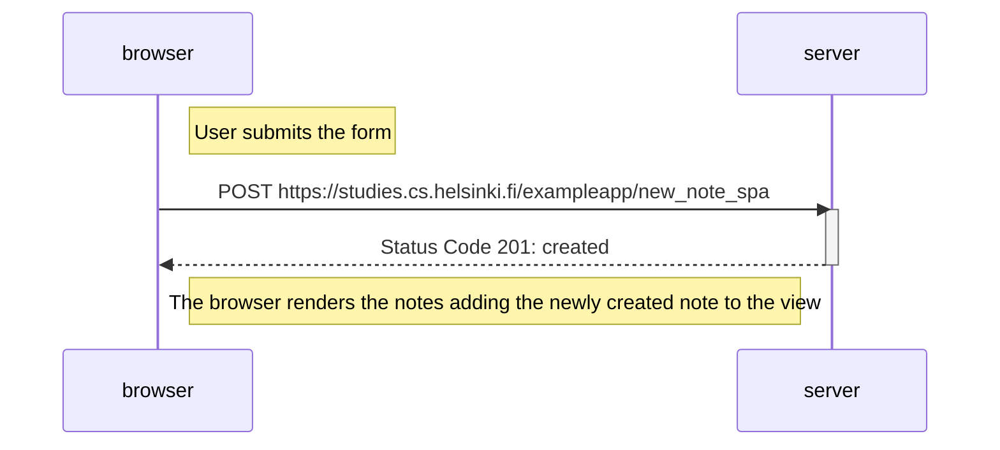

```mermaid
sequenceDiagram
    participant browser
    participant server

    Note right of browser: User submits the form
    browser->>server: POST https://studies.cs.helsinki.fi/exampleapp/new_note_spa
    activate server
    server-->>browser: Status Code 201: created
    deactivate server

Note right of browser: The browser renders the notes adding the newly created note to the view
```